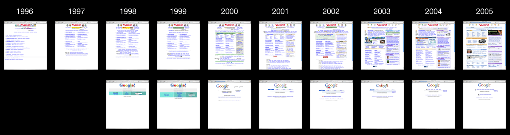
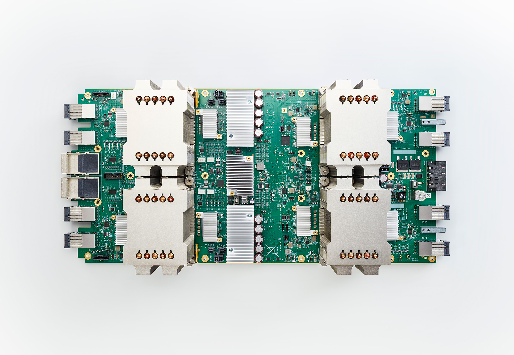
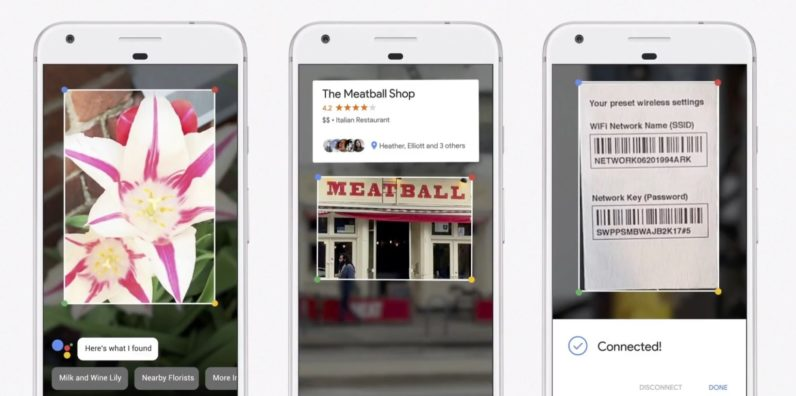

# Michaelangel007's Blog

# CPUs, GPUs, and TPU's -- Google's end game plan to own you.

Friday, May 19, 2017

_"Dear Microsoft, You are about to get completely screwed over and you don't even realize it."_

In [Google's I/O 2017 keynote](https://www.youtube.com/watch?v=Y2VF8tmLFHw) and other talks you may have noticed that Google has literally been hyping the hell out of:

* ML (Machine Learning),
* TPU's (tensor processing unit), and
* TensorFlow (open source machine learning architecture and APIs).

## 1. Some context and history.

Google quickly rose to fame in ~1999 because "web searching" SUCKED.  You would get so many false positive and irrelevant links from a single search engine that you had to use a "meta search" engine that "crawled" a NUMBER of web searching sites and that would curate the links in common such as AltaVista, AskGeeves, DogPile, Lycos, WebCrawler, etc.

* https://en.wikipedia.org/wiki/AltaVista
* [When did Google become the be-all, end-all of search engines?](http://boards.straightdope.com/sdmb/showthread.php?t=532329)

What Google brought to the table was [PageRank](https://en.wikipedia.org/wiki/PageRank) -- a (web) page was relevant NOT _only_ by the content on it, but ALSO what LINKED to it.

* 

This was a game changer.

(Perceived) Popularity of Truth was now more important the actual content!  It didn't matter if you what said was correct if no one believed it (linked to it.)  If you had some crappy inaccurate website, but everyone linked to it, maybe indirectly via cheesy "WebRings", you were getting the "traffic" and others weren't.

Google started selling AdSense and AdWords. Companies sprung up overnight selling SEO (Search Engine Optimizations) -- guaranteeing that your company would rank higher via the right keywords.
Everyone ELSE was doing "Paid Inclusion" -- companies could literally "buy" their way to the top of the search results -- and people hated it since it wouldn't return relevant results like Google did.

* https://en.wikipedia.org/wiki/AdSense
* https://en.wikipedia.org/wiki/AdWords
* https://en.wikipedia.org/wiki/Paid_inclusion

Other companies started "focusing" on becoming a "Web Portal".  The justification was that: "If people are here for search they will want other things as well."

Except, NO, I don't want/need all your other crap -- I _just_ want the results of my search.

This is a timeline of how Yahoo jumped the shark while Google **remained focused on _just_ 1 thing, **Accurate Search Results:

Source: https://blog.codinghorror.com/content/images/2014/May/05_yahoogle.png

Google's popularity exploded almost the day it came online and by 2000 has sealed the deal. Gee, accurate search results go figure.  We'll come back to this point.

Due to the sheer expansion of the web --- there is a TON of data -- Google started running into a problem. How the hell do we:

* crawl the "net" for results?
* save this data?
* query the data that a user wants & provide results in near real-time?

Google solved these problems with a number of technologies:

* MapReduce
* BigTable
* Dremel using low-latency SQL and NoSQL

You can read more details here:

* https://mapr.com/blog/5-google-projects-changed-big-data-forever/

Having "mastered" text searching Google went onto to indexing Pictures and Video -- but we didn't know it at the time as they were quiet for almost a decade.

Every now and then we'd hear rumors about Google being anal retentive over power usage.

In 2009 we finally got the answer. They had been building servers with **their OWN DC power!**

* https://www.cnet.com/news/google-uncloaks-once-secret-server-10209580/

> Google's big surprise: each server has its own 12-volt battery to supply power if there's a problem with the main source of electricity. The company also revealed for the first time that since 2005, its data centers have been composed of standard shipping containers -- each with 1,160 servers and a power consumption that can reach 250 kilowatts.

But _why_ had Google been going completely crazy over power efficiency?

* https://www.google.com/about/datacenters/efficiency/internal/

We know that the indexing the web (and servicing requests) takes up a TON of (disk and memory) space when you have millions of people performing search.

If Google could cut the costs of electricity PER server that would add up.  Exactly how many serves does Google have??  In 2011, it was estimated they had 900,000 servers!

* http://www.datacenterknowledge.com/archives/2011/08/01/report-google-uses-about-900000-servers/

> But new data on Google's energy use suggests that the company is probably running about 900,000 servers.
>
> Google never says how many servers are running in its data centers. The new estimate is based on information the company shared with Stanford professor Jonathan Koomey, who has just released an updated report on data center energy usage.
>
> "Google's data center electricity use is about 0.01% of total worldwide electricity use and less than 1 percent of global data center electricity use in 2010,"

**WHOA.**

No wonder they were kicking the crap out of other search engines -- the others guys had a HUGE electric bill right from the get go !!

In the vernacular: Google was able to SCALE in **both** Hardware and Software.

So they have a TON of storage, a TON of horsepower, but what does that have to do with searching Pictures, Video, and Speech?

All that horsepower was INSUFFICIENT.

WHAT?!

Machine Learning is the latest buzzword that means multi-dimensional dynamic-data-storage and static-data-lookup.

Here is an example:

Let's say we want a computer to identity a picture.

First thing would do is generate "mip-maps"

Source: https://www.gamedev.net/uploads/monthly_06_2011/ccs-8549-0-46062900-1308172686.gif

Here is a simplified description:

We keep scaling a picture smaller and smaller until we reach some threshold, say 32x32.

Then we start analyzing EACH picture, in these 32x32 chunks.  We store "weights", or a normalized number between 0.0 and 1.0 for every "feature" it has.

All these weights are like a "digital" fingerprint.  But instead of an single digital number like an 64-bit int, we have a "fuzzy" 32x32x3 (width x height x 3 channels red/green/blue) = 3,072 weights.

Here is an animated picture of how it works:

* 

Source: https://giphy.com/gifs/3oEduSJjAm3B34j4EU/

You can read the gory details about convolution neural nets here:

* https://en.wikipedia.org/wiki/Convolutional_neural_network

Google has a write-up about identifying 32x32 images.
* https://www.tensorflow.org/tutorials/deep_cnn

We basically need to feed it a TON of images -- this is the training process.

> In 2015 a many-layered CNN demonstrated the ability to spot faces from a wide range of angles, including upside down, even when partially occluded with competitive performance. The network trained on a database of **200,000 images that included faces** at various angles and orientations and a further **20 million images without faces.** They used batches of 128 images over 50,000 iterations.

Why ALL that training?

* Too FEW data and you have false positives or Under-fitting.
* Too MUCH (irrelevant) data and you have potentially run into [Over-fitting](https://en.wikipedia.org/wiki/Overfitting)

What does recognizing Pictures, Video, and Speech all have in common?

This training process is ALL number crunching.

Gee, if only we had a dedicated device that was specifically built for parallel floating-point operations.

Oh wait, what's that GPU thing I keep hearing about?

In 2005 GPU's started being used for "Machine Learning."
https://www.computer.org/csdl/proceedings/icdar/2005/2420/00/24201115-abs.html

GPU's contained to get faster and faster -- but they were also, ironically, TOO general purpose!  At the end of the day you need the right bits in the right space at the right time -- you don't need the FULL operations of the GPU.

ASICs (Application-specific integrated circuits) to the rescue!

ASICs are just another word for _specialized hardware._

By cutting out all the extra stuff you _don't need_ you can build minimal circuits dedicated to solving just the ONE (or few) problem -- this is EXTREMELY efficient and low power.

https://en.wikipedia.org/wiki/Tensor_processing_unit

> Tensor processing units (or TPUs) are application-specific integrated circuits (ASICs) developed specifically for machine learning. 
> Compared to graphics processing units, they are designed explicitly for a higher volume of reduced precision computation (e.g. as little as 8-bit precision) with higher IOPS per watt, and lack hardware for rasterisation/texture mapping.

You'll notice that the BitCoin "miners" went through the same migration path a few years back as well: CPU -> GPU -> ASIC.  No one uses CPU's for BitCoin mining because searching/generating the hashes/key is S-L-O-W compared to ASICs.

One of these little guys ...

* 

Source: https://storage.googleapis.com/gweb-uniblog-publish-prod/images/tpu-V2-hero.width-2000.png

... is powering this:

* 

Source: http://cdn.wccftech.com/wp-content/uploads/2017/05/tpu-v2-1.width-1000.png

This is what Google is saying about their 2nd generation TPUs:

https://www.blog.google/topics/google-cloud/google-cloud-offer-tpus-machine-learning/

> Each of these new TPU devices delivers up to 180 teraflops of floating-point performance. 
>
> One of our new large-scale translation models used to take a full day to train on 32 of the best commercially-available GPUs—now it trains to the same accuracy in an afternoon using just one eighth of a TPU pod.

180 teraflops/each!? WOW.

That partially answers the question of _"What the hell does Google NEED with this amount of computing power???"_

## 2. So where are we today?

* Notice how Google started on the back end with textual search.
* They have made significant in roads with "Image Search"
* They have the map meta-information with Google Maps
* They have the visual road information with [StreetView](https://www.google.com/streetview/understand/)
* They have a front end with Android
* They can detect _different_ speakers giving voice commands
* They are joining the front-end and back end when they demo "Google Lens" -- take a picture on your phone, and google will give the META information about it. 

Now in order to LINK the visual information with the textual meta-information they need to first ... drum-roll ... RECOGNIZE the image!

The keynote demoed Google Lens [@ 12:05](https://youtu.be/Y2VF8tmLFHw?t=725) showing "The Meatball Shop":

* 

Source: https://cdn3.tnwcdn.com/wp-content/blogs.dir/1/files/2017/05/Google-Lens-796x396.jpg

There is the animated version on twitter:

* [Meatball video](https://video.twimg.com/tweet_video/DAC2WPKXUAAPXdy.mp4)

Source: https://twitter.com/google/status/864891667723300864

Here is a quick analysis:

* 
* 
* 

Google is solving _several_ hard problems here leveraging their infrastructure:

* Upload the Real-Life (TM) image to their TPU Cloud -- they avoid the cost of physical network lines by leveraging ISPs (Internet Services Providers) existing infrastructure
* Recognize the image by querying what known images it matches -- It may already be in the system via Google StreetView or may be an entirely new image
* Classify what is IN the image -- it contains a business shop and sign
* If the user's Location Service is [enabled](https://support.google.com/accounts/answer/3467281?hl=en) on the device then send the GPS information to help query from Maps in order to narrow down the search space
* Retrieve the vendor's name, location, and other relevant info such as phone number
* Associate the picture with textual information, and save this so the next query is faster
* Send the contextual information back to the user

To the end user it looks like "Magic."

## 3. What exactly is Google's long-term game plan here?

I believe that:

**Google wants end-to-end control all the way from the back-end to the front-end.**

They don't care (as much) about the front-end (Web Browser, Mobile, or Tablet) since they have all the back end stuff you think you want / need.

In the [Keynote @5:22](https://youtu.be/Y2VF8tmLFHw?t=322) this picture of Sundar Pichai's keynote shows how Google's "World Domination" is coming along:

* 

Source: http://cdn02.androidauthority.net/wp-content/uploads/2017/05/Google-IO-billion-users-1340x754.jpg

Let's "count" the "platforms" from left-to-right:

* Google (Search)
* Android (Mobile)
* Chrome (Web Browser)
* YouTube (Content Consumption)
* Maps (Resources)
* Pictures (Communication)
* Gmail (Communication)

Also notice how all of these are FREE.  Google knows that people don't want pay anything for apps.   This is Google's "end run around" Microsoft's control of the desktop.  Google's sub-conscious thinking is along these lines:

> "Screw you Microsoft -- we'll just re-route around your shitty Windows ecosystem and _control everything else._"

This is just a modern paraphrasing of [John's Gilmore quote](https://en.wikiquote.org/wiki/John_Gilmore):

* _"The Net interprets censorship as damage and routes around it."_

This is why I believe Microsoft is ultimately doomed.

When people say Bill Gates **completely** missed the Internet in 1995 -- that was the understatement of the CENTURY.  Google is looking at the END game here.  Microsoft doesn't even know the game was over before it started!

By providing "convenience" of all sorts of information Google is data-mining the hell out of you.

And guess what, _people WILLINGLY give up any sense of privacy for convenience._

I believe Google is ultimately going after the "big prize" -- make it trivial to buy and get the information you "need" -- all the while Google has their fingers in ALL the pieces of the pie.  From the hardware of Mobile and Wearables to services such as Lens and Wallet.

Think BIG picture here.

http://www.businessinsider.com/google-launches-hands-free-payments-in-some-restaurants-2016-3

> Google wants you to be able to grab a slice of pizza without taking out your phone or wallet.

It is a capitalists dream -- your "wearables" enable you to purchase anything conveniently.

It doesn't stop there.

When Google first got into autonomous cars a lot of people were sratching their heads asking _"Huh! What? Why is a **search company** getting into the **automotive industry for?** That makes no sense."_

ML (Machine Learnign) is the "bridge."

This explains not only _why_ but **how** Google is getting into autonomous cars. By having Google Maps they are able to leverage their back end services to get a foothold into the client in the car.
* https://www.android.com/auto/

Picture this: 

In a decade Google will have a self-driving car that you can buy -- powered by Android Auto of course -- that knows when and where you go to work (Google Contacts), when and were you come home, what your schedule is (Google Calendar), when and where you travel (Google Maps), how to control all the appliances in your house (Google Home), what you watch (YouTube), who your friends are (GMail), and what they look like (because you uploaded all your photos to their free Picasso, er, Google Photos), what your bank account information is (Google Wallet), what your spending habits are, how to target specific ads to you, is always listening to you (Google Assistant), knows how to reach your friends (Google Voice), has a record of everything you have said, what brands and types of clothes you wear, how often you buy them, when you sleep (Android Wear), how often you awake -- and that's just TODAY'S _existing_ technology.

Someone just has to _"connect the (meta) dots"._

Hmmm, I don't know about you **but being tracked to that deep level that creeps the hell out of me.**

I'm not exactly sure if that the kind of world I want to live in -- where a single company (*) has this much information over an individual.

(*)  I'm not saying Apple is any better -- but so far they haven't played their hand like Google has.

Are there any laws to guarantee Google doesn't abuse this consolidation of power?

What does this have to do with Microsoft?

Microsoft seems to be completely clueless about winning the battle and losing the entire war -- except they are losing the battle too!  They blew how many billions on Nokia again? 7.2 Billion plus ANOTHER ~billion !

https://www.theverge.com/2016/5/25/11766540/microsoft-nokia-acquisition-costs

> Microsoft is taking another almost $1 billion hit on its failed Nokia acquisition today. The software maker is "streamlining" its smartphone business, writing off $950 million and cutting 1,850 jobs. 

Ironically, with the backlash of Windows 10's spyware and forced upgrades, Microsoft is pushing people right into Google's hands.

If I was Microsoft right now I would be VERY, VERY worried about being made completely irrelevant in 20 years.  

The handwriting is already on the wall -- back in 2015 **not one single Windows machine made the Top 500** super-computer list.

https://en.wikipedia.org/wiki/TOP500

> Since November 2015, no computer on the list runs Windows. 

The sad part -- Microsoft doesn't even know what the hell they are doing!  Already 33% of Azure runs Linux.  While Microsoft is trying to cater to developers but they are so focused on a single tree that they have missed the forest being clearcut around them.

* https://news.microsoft.com/bythenumbers/azure-virtual

Of the major "computing" spaces *nix is winning big:

* [ ] Desktop
* [x] Consoles (FreeBSD is used in Sony's PS3 & PS4 and Nintendo's Switch; Xbox One uses Windows, obviously)
* [x] Mobile (Android has 2 Billion devices powered by Linux.)
* [x] Servers (66% powered by *nix)
* [x] Supercomputers (100% powered by *nix)

It is going to be REAL interesting in the next decade as Microsoft scrambles to not miss the boat.  Is it too late?

Time will tell.

You can leave feedback [here](https://github.com/Michaelangel007/blog/issues/1)

P.S.

NOTE: I have NOT read "The Google Story" so my time frame may be off but the overall gist should be accurate:

* http://www.thegooglestory.com/fromthebook.html

## Special Thanks

* Jason, Matthew, and Wayne for positive feedback.
